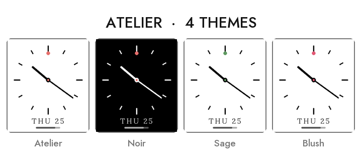

# Atelier

A minimalist analog watchface for the Pebble Time 2 (emery): thin hour ticks,
two clean hands, a small accent dot at 12, with a subtle date and battery bar
below. Designed to feel calm on the 64-colour panel.


## Themes

Four colour themes, picked in the watchface **Settings** screen and persisted on
the watch: **Atelier** (warm orange on white), **Noir** (inverted), **Sage**
(green accent) and **Blush** (pink accent). See `store/banner-themes.png`.



## Build

```sh
export PATH="$HOME/.local/bin:$PATH"
pebble build < /dev/null
pebble install --emulator emery < /dev/null
pebble screenshot wf.png --emulator emery --no-open < /dev/null
```

- UUID: `666d6ac7-aa22-4882-a714-27968ad389fd`
- Platform: `emery` (Pebble Time 2). Fonts: Jost Medium + Lora Medium.
