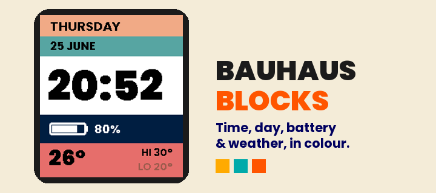

# Bauhaus Blocks

A bold, all-left watchface for the Pebble Time 2 (emery), built around five flat
colour bands — designed to suit the panel's pixellated, 64-colour display: thick
type, hard edges, no gradients.



## Rows

| Band | Colour | Shows |
|------|--------|-------|
| Day | amber | full weekday, e.g. `THURSDAY` |
| Date | teal | `25 JUNE` |
| Time | white | large `HH:MM` (respects 12/24h setting) |
| Battery | navy | battery glyph + percent |
| Temperature | orange | current °C (large) + today's hi / lo |

## Weather

Temperature comes from [Open-Meteo](https://open-meteo.com) (no API key). The
phone-side JS (`src/pkjs/index.js`) reads the phone's location, fetches the
current temperature plus today's high/low, and sends rounded °C integers to the
watch. Needs a connected phone with internet + location; falls back to Amsterdam
if location is unavailable.

## Build

```sh
export PATH="$HOME/.local/bin:$PATH"
pebble build < /dev/null
pebble install --emulator emery < /dev/null
pebble screenshot wf.png --emulator emery --no-open < /dev/null
```

- UUID: `d1605747-f220-4dee-970f-2b37811ad118`
- Platform: `emery` (Pebble Time 2). Fonts: Poppins Black (time/temp) + Poppins Bold.
