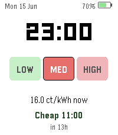

# Dutch Energy Watchface

A Pebble Time 2 **watchface** showing **Dutch dynamic electricity prices** next
to the time, date, and watch battery — at a glance.



> **Netherlands only.** Prices come from the public **EnergyZero** API, in
> **ct/kWh incl. BTW**. Not useful outside the Dutch dynamic-tariff market.

## What's on screen
- **Time + date** and an **iPhone-style battery** indicator (top row).
- **LOW / MED / HIGH split** — where the current price sits within today's
  range (green = cheap third, orange = mid, red = expensive). The current band
  is filled and outlined.
- **Current price** in ct/kWh.
- **Next cheap window** — when the cheapest upcoming block starts and how many
  hours away it is.

## How it works
No account, login, or API key. The phone side (`src/pkjs/index.js`) fetches the
forward-24h hourly series from EnergyZero, finds the cheapest 4-hour block, and
sends a compact packet to the watch. The clock and battery render even before
prices arrive; prices refresh on load and at the top of every hour.

> Want the full 24-hour bar graph and the cheapest-block detail? That lives in
> the launchable **[NL Energy](../energy)** app.

## Build & run
```sh
pebble build
pebble install --emulator emery       # run in the emery emulator
pebble install --phone <phone-ip>     # sideload to a paired watch (dev connection)
```

## Platforms
Targets **emery** (Pebble Time 2) only — the layout is tuned for its 200×228
screen.

## Documentation
Pebble SDK docs and API reference: <https://developer.repebble.com>
