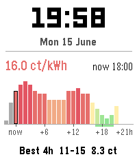

# NL Energy

A Pebble Time 2 **watchface** showing **Dutch dynamic electricity prices** next
to the time and date: the current price, a forward 24-hour graph, and the
cheapest upcoming 4-hour window — so it earns its place as your default face and
tells you when to run the dishwasher.



> **Netherlands only.** Prices come from the public **EnergyZero** API (the data
> behind several Dutch dynamic-tariff suppliers), shown in **ct/kWh including
> BTW**. It is not useful outside the Dutch dynamic-tariff market. To adapt it to
> another country, swap the API and price math in `src/pkjs/index.js`.

## Layouts
The face has **three layouts** you cycle through with a **tap / wrist-shake**;
your choice is remembered:
- **Clock hero** — large time + date up top, then a price line, the 24h graph,
  and the cheapest-block footer.
- **Price frame** — the screen border is tinted by the current price (green →
  red), so you can read "cheap or expensive" from across the room; clock, date,
  and a slim graph sit inside.
- **Minimal** — just the time, full date, the current price, and the cheapest
  window. No graph.

The colour coding, 24h bar graph (with ~2h of greyed past context, the current
hour outlined, and a green marker under the cheapest contiguous **4-hour**
block), and the cheapest-block footer are shared across the graph layouts.

## Controls & settings
- **Tap / shake** — switch layout (clock-hero → price-frame → minimal).
- Open the watchface **settings** in the Pebble phone app to pick the startup
  layout and turn tap-to-switch on/off.
- There is no refresh button (watchfaces have no buttons): prices refresh
  automatically when the face loads and at the top of every hour.

## How it works
No account, login, or API key. The phone side (`src/pkjs/index.js`) fetches the
forward-24h hourly series from the public EnergyZero API, picks the cheapest 4h
block, and sends a compact packet to the watch. The watch has no direct internet,
so the phone must be connected.

## Build & run
```sh
pebble build
pebble install --emulator emery       # run in the emery emulator
pebble install --phone <phone-ip>     # sideload to a paired watch (dev connection)
```
For the end-user (no toolchain) install path, see the [repo README](../README.md#install).

## Platforms
Targets **emery** (Pebble Time 2) only — the layout is tuned for its 200×228
screen. To build for other Pebble watches, add them to `targetPlatforms` in
`package.json` and expect to adjust the graph geometry.

## Documentation
Pebble SDK docs and API reference: <https://developer.repebble.com>
