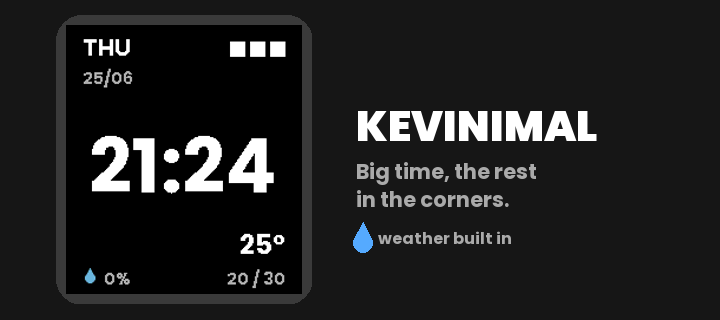

# Kevinimal

A minimal watchface for the Pebble Time 2 (emery). The time floats large in the
centre; everything else tucks into a corner. Pure black, high-contrast.



## Layout

| Corner | Shows |
|--------|-------|
| Top-left | day (3-letter) + `DD/MM` |
| Top-right | battery as 3 blocks (fill ≤33→1, ≤66→2, else 3) |
| Centre | large `HH:MM` (respects 12/24h setting) |
| Bottom-left | chance of rain (blue drop + %) |
| Bottom-right | current temp, with today's low / high below |

## Weather

From [Open-Meteo](https://open-meteo.com) (no API key). The phone-side JS
(`src/pkjs/index.js`) reads location and fetches current temperature, today's
high/low and precipitation probability, then sends them to the watch. Needs a
connected phone with internet + location; falls back to Amsterdam otherwise.
Time, date and battery work offline.

## Build

```sh
export PATH="$HOME/.local/bin:$PATH"
pebble build < /dev/null
pebble install --emulator emery < /dev/null
pebble screenshot wf.png --emulator emery --no-open < /dev/null
```

- UUID: `3c355b62-ffd1-4892-ab02-5b16a2482f47`
- Platform: `emery` (Pebble Time 2). Font: Poppins Bold.
